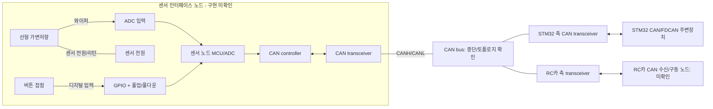

# 회로 및 배선 설계 기록

## 설계 상태

아래는 노드/신호 수준의 참조도이며 제작용 회로도가 아닙니다. 보드 모델, 데이터시트, 전압/전류 범위, 핀맵, 보호소자와 종단을 확인하기 전에는 실제 배선을 확정하지 않습니다. 부품번호·값을 추정해 채우지 마세요.

## 노드 연결도

예상 구조는 센서 노드, STM32, RC카 수신 노드의 3개 CAN 노드입니다. 각 노드에는 CAN 컨트롤러와 물리 계층 트랜시버가 필요하지만, MCU/ESC 보드에 내장된 기능은 별도 부품으로 추가하지 않습니다. STM32F407 계열 MCU에는 CAN 컨트롤러(bxCAN)가 내장되어 있어 외부 CAN 컨트롤러 칩은 보통 추가하지 않지만, CANH/CANL용 물리 트랜시버는 별도로 필요합니다. 정확한 MCU/보드 및 ADuM20 모듈 기능은 실물 마킹/데이터시트로 확인합니다.

현재 외부 모듈 2개는 STM32 노드와 센서 노드에 하나씩 사용할 수 있습니다. 이 경우 RC카 수신/구동 노드에 CAN 트랜시버가 이미 내장되어 있어야 합니다. RC카 측에도 외부 트랜시버가 필요하고 내장되어 있지 않다면 3번째 모듈이 필요합니다. 반대로 센서나 RC카 모듈에 트랜시버가 내장되어 있으면 그만큼 외부 개수를 줄일 수 있습니다. ADuM20 보드가 절연기만 포함하는지, CAN 트랜시버까지 포함하는지 확인하기 전에는 두 개를 필요한 트랜시버 수로 간주하지 않습니다.

## 전기 연결 원칙

- 가변저항 끝단은 센서 노드의 허용 기준 전원/리턴에 연결하고 와이퍼는 해당 노드 ADC에 연결합니다. 저항값, 공급전압, ADC 범위는 데이터시트로 확정합니다.
- 버튼은 센서 노드 GPIO 입력으로 읽습니다. NO/NC, pull-up/down, 디바운스와 단선 상태를 정의합니다. 전압/전류 검토 없이 접점을 전원에 직접 연결하지 않습니다.
- STM32는 아날로그/버튼을 직접 읽는 구성으로 가정하지 않습니다. 센서 노드가 해당 값을 CAN으로 발행합니다.
- CAN TX/RX와 트랜시버 TXD/RXD 대응, 논리 전압, enable/standby는 각 데이터시트와 핀맵에 기록합니다.
- CANH/CANL 극성, 배선 길이/분기, 기준선/절연, 종단은 선택한 물리 계층 사양에 맞춥니다. 고속 CAN의 통상적인 양 끝단 종단값(예: 120 ohm)은 장치/배선 확인 후 적용하고, 중간 노드에 임의로 추가하지 않습니다.
- 모터/구동 전류는 브레드보드나 점퍼선으로 흘리지 않습니다. 신호와 모터 전원 경로를 분리하고 전원/퓨즈/보호를 검토합니다.
- 전원 인가 전 무전원 연속성/단락, 극성, 전압 레벨, 종단을 확인합니다. 첫 CAN 시험은 구동부를 분리한 모의 노드로 수행합니다.

## 작성할 배선 자료

- [Netlist CSV](../hardware/wiring/netlist.csv): 각 전기 연결을 한 행으로 작성합니다. 시작/종단 노드와 핀, 전기 범위, 보호/종단, 근거, 확인 상태를 채웁니다.
- [커넥터 핀아웃 CSV](../hardware/wiring/connector-pinout.csv): 커넥터의 실제 핀 번호, 신호, 상대 커넥터/핀, 방향과 검증자를 기록합니다.
- 같은 폴더에 PDF/원본 회로도와 버전이 보이는 배선 사진을 둡니다. 문서 개정과 Netlist 행 ID를 서로 참조합니다.

## 설계 검토 기록

| 검토 항목 | 담당 | 날짜 | 결과/이슈 |
|---|---|---|---|
| 전압/전류 및 핀 호환성 | 미정 | 미정 | 미정 |
| CAN 물리 계층/종단 | 미정 | 미정 | 미정 |
| 전원/보호/비상 정지 | 미정 | 미정 | 미정 |
| 도면 개정/승인 | 미정 | 미정 | 미정 |
