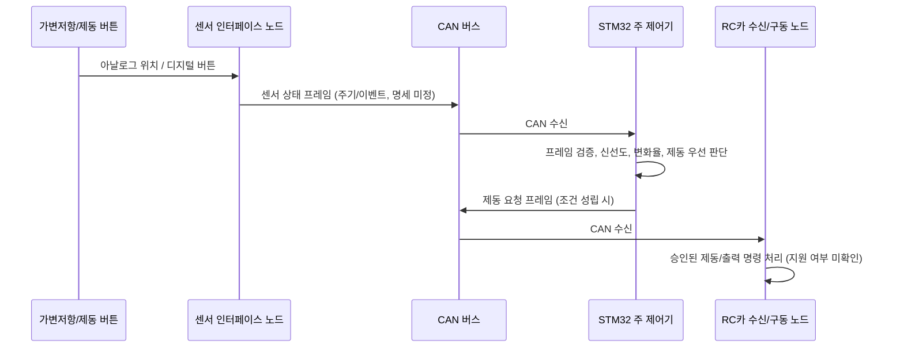

# 데이터 흐름 및 인터페이스 경계

## 범위

이 문서는 페달 신호의 취득에서 STM32 판단, CAN 제동 요청까지의 논리 경로를 정의합니다. CAN ID, 주기, 단위, 핀, 노드 모델 등 확정되지 않은 값은 `미정`으로 둡니다. 논리 노드와 실제 보드/부품은 구분합니다.

## 시스템 데이터 흐름

## 인터페이스 흐름 표

| 흐름 ID | 출발 → 도착 | 데이터 | 전송/처리 | 계약/확인 항목 |
|---|---|---|---|---|
| DF-01 | 가변저항 → 센서 노드 | 와이퍼 전압/ADC 원시값 | 센서 노드에서 ADC 취득 | 저항값, 공급전압, 입력범위, 방향, 단선 동작 |
| DF-02 | 제동 버튼 → 센서 노드 | 눌림/해제 입력 | 센서 노드 GPIO 취득 및 디바운스 | NO/NC, 풀업/다운, 눌림 논리, 디바운스 |
| DF-03 | 센서 노드 → STM32 | 가속 상태, 제동 상태, 순번/시간, 품질 상태 | CAN 센서 프레임 | CAN ID, DLC, 스케일, 주기, 만료시간, 오류표시 |
| DF-04 | STM32 내부 | 검증된 연속 센서 샘플 | 시간 기준 변화율 계산 및 상태 판정 | 샘플 시간 기준, 유효범위, 판정식, 임계값 |
| DF-05 | STM32 → RC카 노드 | 제동 요청, 사유/상태, 순번 | CAN 제동 요청 프레임 | 수신 노드 지원, 메시지 명세, 승인/타임아웃 |
| DF-06 | RC카 노드 → STM32 (필요 시) | 수신 확인/상태/고장 | CAN 상태 프레임 | 필요성, 응답 명세, 타임아웃 |

## 시간/데이터 품질 계약

- 센서 노드는 가속값과 버튼값이 함께 취득된 샘플인지, 각각의 취득 시각이 다른지 명시해야 합니다.
- 변화율은 같은 센서 노드 시간 기준의 연속 샘플로 계산하는 것을 우선합니다. 시간 단위, 카운터 rollover, 리셋 식별, 순번 wrap 정책은 CAN 명세에서 확정합니다.
- CAN 프레임 도착 시각은 수신 시각일 뿐 센서 취득 시각과 같다고 가정하지 않습니다. 송신 타임스탬프가 없으면 버스 지연/지터를 측정하고 그 한계를 기록합니다.
- 순번 누락, 시간 역행, 유효범위 초과, DLC 불일치, 만료 데이터는 정상 샘플로 사용하지 않습니다.
- 어떤 데이터가 무효일 때 제동을 요청/유지/해제할지는 RC카 구동계 안전 검토로 정하고, 임의의 fail-safe 동작을 가정하지 않습니다.

## 구현 전 게이트

| 게이트 | 완료 증거 | 상태 |
|---|---|---|
| 센서 노드가 실제 센서 신호를 CAN으로 발행 | 회로도, 노드 모델/펌웨어, 수신 캡처 | 미정 |
| STM32가 CAN 프레임을 검증/판정 | 단위 시험 및 CAN 로그 | 미정 |
| RC카 노드가 제동 요청을 수신 | 제조사/프로토콜 근거와 모의 시험 | 미정 |
| 실제 출력 동작이 안전하게 검증 | 승인된 벤치 절차와 시험 기록 | 미정 |
