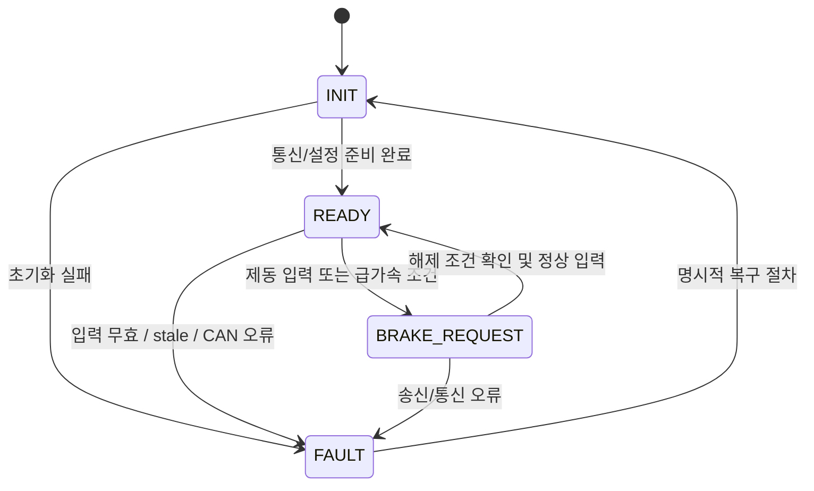

# 소프트웨어 설계 기록

## 책임 경계

STM32는 CAN 수신 프레임을 바탕으로 판단하고 CAN 제동 요청을 발행합니다. 센서의 ADC/GPIO 취득은 센서 인터페이스 노드의 책임입니다. 이 문서의 입력 데이터는 센서 노드가 송신하는 CAN 센서 상태 프레임입니다.

## 처리 파이프라인

1. CAN RX 인터럽트/콜백은 프레임을 제한된 큐에 넣고 수신 시각/오류 상태를 기록합니다. 인터럽트 안에서 변화율 판정이나 복잡한 제동 로직을 수행하지 않습니다.
2. 애플리케이션은 ID, DLC, 프레임 형식, 필드 범위, 카운터/순번, 품질 플래그와 신선도를 검사합니다.
3. 센서 시각이 유효한 연속 가속 샘플에 대해 `rate = (position[n] - position[n-1]) / (time[n] - time[n-1])`을 계산합니다. 시간 단위 변환, 스케일, 방향, 필터와 판정 기준은 측정/요구사항으로 확정합니다.
4. 가속 급변 판정과 유효한 제동 버튼 상태를 상태 중재기에 전달합니다.
5. 상태 중재기는 제동 조건이 참이면 제동 우선 상태를 설정하고, CAN 송신 모듈에 명세된 요청을 전달합니다.
6. 송신 성공/실패, 버스 오프, 응답 타임아웃을 진단 상태와 로그로 남깁니다.

## 상태 머신 초안

상태 이름은 소프트웨어 설계 초안입니다. FAULT 시 물리 출력이 어떻게 되어야 하는지, 제동 요청 유지/반복/해제 조건, 자동 복구 허용 여부는 RC카 제어기와 안전 검토 후 승인해야 합니다. 오류가 발생했다고 임의로 제동 출력을 토글하지 않습니다.

## 모듈 경계

| 모듈 | 입력 | 출력 | 단위 시험 초점 |
|---|---|---|---|
| `can_rx` | STM32 CAN 주변장치 프레임 | RX 큐 이벤트 | DLC/ID/오버플로/버스 오류 |
| `sensor_frame` | RX 이벤트 | 검증된 센서 샘플 | 범위/순번/시간/유효성 |
| `accel_rate` | 연속 샘플 | 변화율/유효성 | 시간 간격, 첫 샘플, wrap, 0 간격 |
| `rapid_accel` | 변화율 및 설정값 | 판정 상태 | 경계값/지속/히스테리시스 |
| `brake_priority` | 제동 입력, 급가속, 오류 상태 | 요청 상태 | 각 조건 및 동시 조건 우선순위 |
| `brake_can_tx` | 요청 상태 | CAN TX 결과/진단 | 필드 인코딩, 실패, 주기 |
| `safety_state` | 전체 진단 이벤트 | 상위 상태 | 오류 전이/복구 조건 |

## 타이밍/유효성 설정 양식

| 설정 ID | 항목 | 값 | 단위 | 출처/승인자 |
|---|---|---|---|---|
| SW-CFG-01 | 센서 프레임 최대 허용 나이 | 미정 | 미정 | 미정 |
| SW-CFG-02 | 샘플 최대 간격/최소 간격 | 미정 | 미정 | 미정 |
| SW-CFG-03 | 급가속 변화율 임계값 | 미정 | 미정 | 계측/승인 필요 |
| SW-CFG-04 | 판정 지속 시간 | 미정 | 미정 | 계측/승인 필요 |
| SW-CFG-05 | 해제 임계값/조건 | 미정 | 미정 | 안전 검토 필요 |
| SW-CFG-06 | CAN 송신 주기/응답 시간 | 미정 | 미정 | 프로토콜 승인 필요 |

설정값은 소스 코드 상수에 숨기지 말고 버전, 단위, 근거, 승인 상태와 함께 기록합니다. 실차 구동 출력 전에는 모의 CAN 노드에서 경계/오류 시험을 통과해야 합니다.
