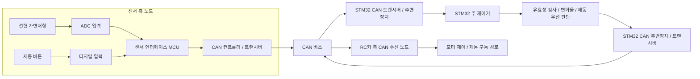

# 시스템 개요

## 목적과 경계

STM32는 수신한 페달 상태를 검증하고 급가속을 판단하는 주 제어기입니다. 가변저항과 버튼은 그 자체로 CAN 프레임을 만들지 않으므로, 이 신호를 읽고 CAN으로 발행하는 **센서 인터페이스 노드**가 필요합니다. STM32의 제동 요청을 실제 RC카 동작으로 바꾸려면 별도의 **RC카 측 CAN 수신/구동 노드**도 필요합니다. 두 노드의 구현/지원 여부는 아직 확인되지 않았습니다.

위 그림은 의도한 논리 구조입니다. 세 노드가 같은 CAN 버스를 공유하려면 물리 계층, 비트레이트, 프레임 형식이 서로 호환되어야 합니다. 현재 보유 목록에는 센서 인터페이스 노드와 RC카 측 CAN 수신 노드가 확인되지 않았고, CAN 트랜시버도 노드별 필요 수량이 확정되지 않았습니다.

## 데이터 및 제어 처리

1. 센서 인터페이스 노드는 가변저항과 버튼을 전기적으로 읽고, 유효 범위/상태/샘플 순번 및 시간 정보를 CAN 센서 프레임으로 발행합니다.
2. STM32는 CAN 프레임을 수신 큐에서 가져와 ID, DLC, 값 범위, 순번, 신선도와 오류 상태를 검사합니다.
3. 유효한 가속 샘플의 연속 값과 동일한 시간 기준을 사용해 변화율을 계산합니다. 샘플 시간 단위, 판정식, 필터, 임계값, 지속 시간은 실측/요구사항 결정 전까지 미정입니다.
4. 제동 버튼 입력 또는 급가속 판정이 참이면 STM32 상태 로직이 제동 요청을 우선합니다.
5. STM32는 확정된 명세의 CAN 제동 요청 프레임을 발행합니다. RC카 측 노드가 요청을 지원하는지는 별도 확인이 필요합니다.

CAN은 메시지를 전달할 뿐 전류를 직접 끊거나 기계적으로 제동하지 않습니다. 실제 동작은 RC카 측 수신 제어기와 검증된 구동 회로에 달려 있습니다. 이 문서는 요청을 생성하는 논리 설계이며, 실제 제동 동작을 보장하지 않습니다.

## 노드별 책임

| 노드 | 입력 | 처리 | 출력 | 확인 상태 |
|---|---|---|---|---|
| 센서 인터페이스 노드 | 가변저항, 버튼 | ADC/디지털 취득, 범위 검사, 순번/시간 부여 | CAN 센서 상태 프레임 | 노드/부품 미확인; 필수 설계 항목 |
| STM32 주 제어기 | CAN 센서 상태 프레임 | 프레임 유효성/신선도 검사, 변화율, 급가속, 제동 우선 중재 | CAN 제동 요청 프레임 | 주 제어기로 지정; 모델/주변장치 미확인 |
| RC카 측 수신/구동 노드 | CAN 제동 요청 | 승인된 요청 처리 | 모터/제동 출력 | CAN 지원 및 회로 미확인 |

## 오류 및 안전 요구

- 잘못된 DLC/ID, 범위 초과, 순번 오류, 데이터 타임아웃을 정상 센서값으로 처리하지 않습니다.
- 센서 데이터가 유효하지 않으면 가속을 허용하는 정상 상태로 간주하지 않고 오류 상태로 전이합니다. 오류 시 출력 정책은 RC카 구동 방식과 안전 분석을 바탕으로 확정합니다.
- STM32 리셋, 버스 오프, 송신 실패, RC카 수신 타임아웃의 반응과 복구 조건을 요구사항으로 기록하고 시험합니다.
- 모의 노드와 고정된 벤치 검증, 독립적인 전원 차단/비상 정지 수단을 실제 구동 연결보다 먼저 준비합니다.
- 소프트웨어/CAN 정지 요청은 물리적 비상 정지나 안전 인증을 대체하지 않습니다.

## 미확정 결정사항

- 센서 인터페이스 노드와 RC카 측 수신/구동 노드의 구현 및 모델
- 각 노드의 CAN 컨트롤러/트랜시버 보유 수량과 전압 호환성
- 한 버스로 통합할지, 별도 버스/게이트웨이를 둘지
- STM32 모델, CAN/FDCAN 주변장치와 센서 측/RC카 측 핀 배치
- 신호 범위/스케일, 샘플 주기, 시간 기준과 급가속 판정 기준
- 비트레이트, ID, DLC, 바이트 순서, 카운터/체크섬, 타임아웃
- RC카 모터 제어기의 CAN 지원과 실제 제동/전류 차단 방법
- 센서 오류, 통신 단절, 리셋 시 승인된 안전 상태 및 해제 절차

세부 기록 양식은 [데이터 흐름](data-flow.md), [회로 및 배선 설계](circuit-design.md), [소프트웨어 설계](software-design.md), [CAN 인터페이스](can-protocol.md), [요구사항 추적표](requirements-traceability.md), [시험 계획](test-plan.md)을 사용합니다.